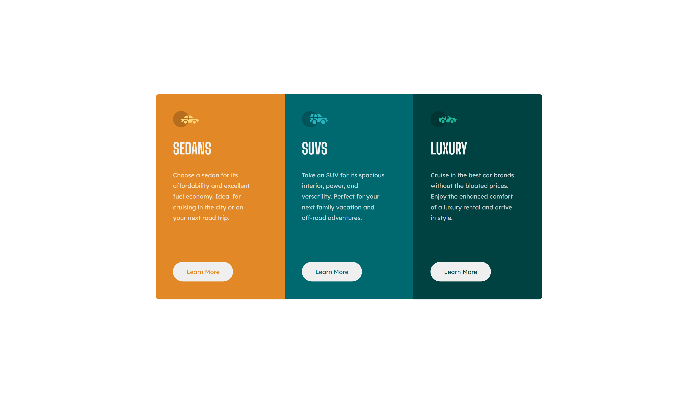

# Frontend Mentor - 3-column preview card component solution

This is a solution to the [3-column preview card component challenge on Frontend Mentor](https://www.frontendmentor.io/challenges/3column-preview-card-component-pH92eAR2-). Frontend Mentor challenges help you improve your coding skills by building realistic projects. 

### Screenshot

### Links

- Solution URL: [solution](https://github.com/bvictor-a/Desafios-FrontEnd/tree/3-column-card)
- Live Site URL: [live site](https://desafios-front-end-git-3-column-card-bruno-vr.vercel.app/)
## My process

### Built with

- Semantic HTML5 markup
- CSS custom properties
- Flexbox

## Author

- Frontend Mentor - [@Bruno-Vr](https://www.frontendmentor.io/profile/Bruno-VR)