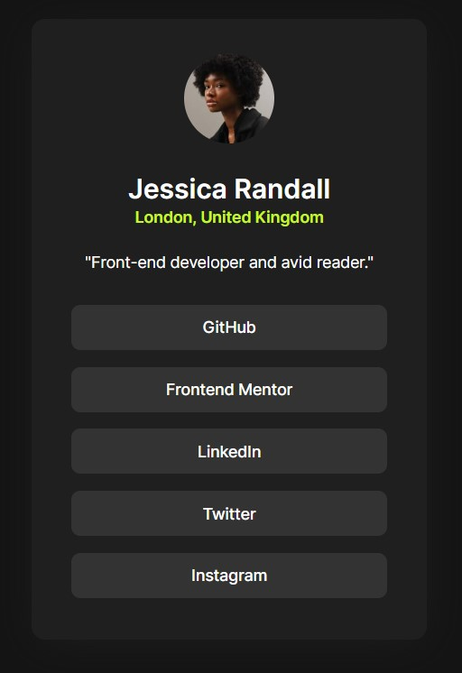

# Frontend Mentor - Social links profile solution

This is a solution to the [Social links profile challenge on Frontend Mentor](https://www.frontendmentor.io/challenges/social-links-profile-UG32l9m6dQ). Frontend Mentor challenges help you improve your coding skills by building realistic projects. 

## Overview

### Links

- Solution URL: [Solution](https://www.frontendmentor.io/solutions/social-links-profile-LQeLgLIE9f)
- Live Site URL: [Live site](https://desafios-front-end-ksnc-60ik3q0ae-brunovrs-projects.vercel.app/)

## My process

### Built with

- Semantic HTML5 markup
- CSS custom properties
- Flexbox

## Author

- Frontend Mentor - [@bvictor-a](https://www.frontendmentor.io/profile/bvictor-a)
