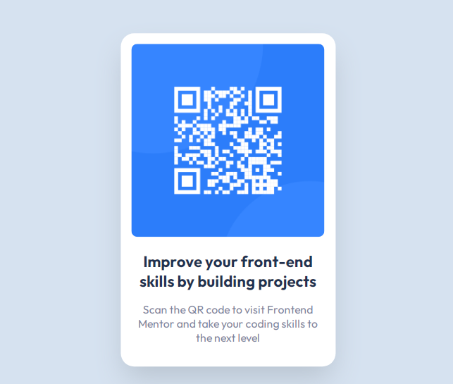

# Frontend Mentor - QR code component solution

This is a solution to the [QR code component challenge on Frontend Mentor](https://www.frontendmentor.io/challenges/qr-code-component-iux_sIO_H). Frontend Mentor challenges help you improve your coding skills by building realistic projects. 

### Screenshot

### Links

- Solution URL: [solução](https://www.frontendmentor.io/solutions/qr-code-component-YtCOr_BqOp)
- Live Site URL: [Site ao vivo](https://desafios-front-foy0psbd5-bruno-vr.vercel.app/)

## My process

### Built with

- Semantic HTML5 markup
- CSS custom properties
- Flexbox

## Author

- Frontend Mentor - [@Bruno-VR](https://www.frontendmentor.io/profile/Bruno-VR)
