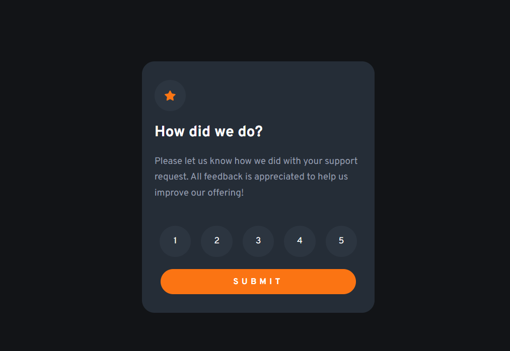

# Frontend Mentor - Interactive rating component solution

This is a solution to the [Interactive rating component challenge on Frontend Mentor](https://www.frontendmentor.io/challenges/interactive-rating-component-koxpeBUmI). Frontend Mentor challenges help you improve your coding skills by building realistic projects. 

### Screenshot

### Links

- Solution URL: [Solution](https://www.frontendmentor.io/solutions/interactive-rating-component-SgB-8f93aY)
- Live Site URL: [Live site](https://desafios-front-end-git-interactive-rating-bruno-vr.vercel.app/)

## My process

### Built with

- Semantic HTML5 markup
- CSS custom properties
- Flexbox

## Author

- Frontend Mentor - [@BRUNO-VR](https://www.frontendmentor.io/profile/Bruno-VR)
